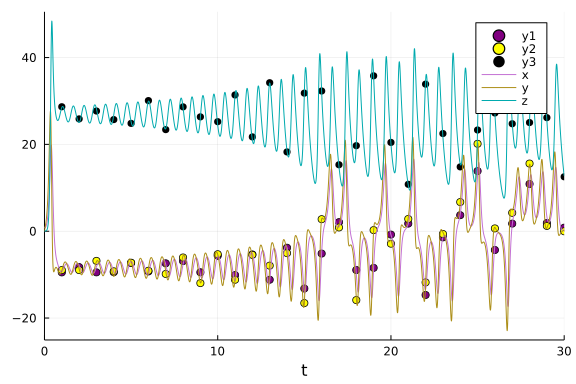
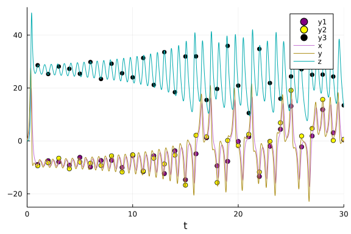
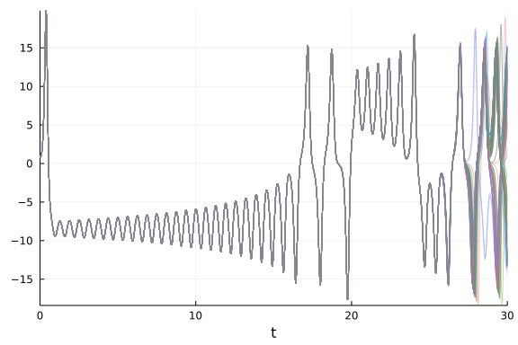

## Parameter estimation of Lorenz Equation using DiffEqBayes.jl

```julia
using DiffEqBayes
using DiffEqCallbacks
using Distributions, StanSample, DynamicHMC
using OrdinaryDiffEq, RecursiveArrayTools, ParameterizedFunctions, DiffEqCallbacks
using Plots, LinearAlgebra
```


```julia
gr(fmt=:png)
```

```
Plots.GRBackend()
```


#### Initializing the problem

```julia
g1 = @ode_def LorenzExample begin
  dx = σ*(y-x)
  dy = x*(ρ-z) - y
  dz = x*y - β*z
end σ ρ β
```

```
(::Main.##WeaveSandBox#501.LorenzExample{Main.##WeaveSandBox#501.var"###Par
ameterizedDiffEqFunction#503", Main.##WeaveSandBox#501.var"###Parameterized
TGradFunction#504", Main.##WeaveSandBox#501.var"###ParameterizedJacobianFun
ction#505", Nothing, Nothing, ModelingToolkit.ODESystem}) (generic function
 with 1 method)
```


```julia
r0 = [1.0; 0.0; 0.0]
tspan = (0.0, 30.0)
p = [10.0,28.0,2.66]
```

```
3-element Vector{Float64}:
 10.0
 28.0
  2.66
```


```julia
prob = ODEProblem(g1, r0, tspan, p)
sol = solve(prob,Tsit5())
```

```
retcode: Success
Interpolation: specialized 4th order "free" interpolation
t: 362-element Vector{Float64}:
  0.0
  3.5678604836301404e-5
  0.0003924646531993154
  0.003262343160292866
  0.00905768915231668
  0.016955558260817218
  0.027688386680734336
  0.04185394923402222
  0.060237081190933954
  0.08368091876192292
  ⋮
 29.454408494490817
 29.535835164147258
 29.605800810317636
 29.680544174694248
 29.76351890459441
 29.830453918417025
 29.895187904722093
 29.95135307026362
 30.0
u: 362-element Vector{Vector{Float64}}:
 [1.0, 0.0, 0.0]
 [0.9996434557625105, 0.0009988049817849054, 1.7814349300524274e-8]
 [0.9961045497425811, 0.010965399721242273, 2.1469572398550344e-6]
 [0.969359731583511, 0.08976885926574524, 0.00014379728741456088]
 [0.9242069970136711, 0.24227921748230874, 0.0010460982665403552]
 [0.8800496059816251, 0.4387144111226294, 0.003424048327994956]
 [0.8483334490657588, 0.6915266898669252, 0.008487275727945722]
 [0.8494997033541277, 1.014487977850381, 0.018211867322766986]
 [0.9138893443162334, 1.4424796048698445, 0.03669462235325828]
 [1.088820494006628, 2.05219890108628, 0.07402932469846653]
 ⋮
 [12.961134303018877, 18.279916904861146, 26.258962444067976]
 [14.392466260222388, 11.508994429323067, 37.65923086851564]
 [10.152339064797642, 2.2699837480561658, 36.54710360000281]
 [4.808587190504637, -0.8952965955597834, 30.113689785295996]
 [1.6024271314668534, -0.6846109436736929, 23.951371533476213]
 [0.6084336689760931, -0.2578082662343863, 20.014754632560162]
 [0.2684894403687644, -0.002834176652118804, 16.84561177410038]
 [0.18738578530207153, 0.1429988182327279, 14.508660208174858]
 [0.19493632279910122, 0.2638435604728404, 12.749360557719715]
```


#### Generating data for bayesian estimation of parameters from the obtained solutions using the `Tsit5` algorithm by adding random noise to it.

```julia
t = collect(range(1, stop=30, length=30))
sig = 0.49
data = convert(Array, VectorOfArray([(sol(t[i]) + sig*randn(3)) for i in 1:length(t)]))
```

```
3×30 Matrix{Float64}:
 -9.4863   -8.26604  -9.4762   -9.43856  …  10.8774   1.88372   0.817086
 -8.95311  -8.95638  -6.83362  -9.24249     15.5811   1.22196  -0.0205546
 28.6646   25.8673   27.6821   25.7067      25.0258  26.1566   12.5355
```


#### Plots of the generated data and the actual data.

```julia
Plots.scatter(t, data[1,:],markersize=4,color=:purple)
Plots.scatter!(t, data[2,:],markersize=4,color=:yellow)
Plots.scatter!(t, data[3,:],markersize=4,color=:black)
plot!(sol)
```




#### Uncertainity Quantification plot is used to decide the tolerance for the differential equation.

```julia
cb = AdaptiveProbIntsUncertainty(5)
monte_prob = EnsembleProblem(prob)
sim = solve(monte_prob,Tsit5(),trajectories=100,callback=cb,reltol=1e-5,abstol=1e-5)
plot(sim,vars=(0,1),linealpha=0.4)
```



```julia
cb = AdaptiveProbIntsUncertainty(5)
monte_prob = EnsembleProblem(prob)
sim = solve(monte_prob,Tsit5(),trajectories=100,callback=cb,reltol=1e-6,abstol=1e-6)
plot(sim,vars=(0,1),linealpha=0.4)
```



```julia
cb = AdaptiveProbIntsUncertainty(5)
monte_prob = EnsembleProblem(prob)
sim = solve(monte_prob,Tsit5(),trajectories=100,callback=cb,reltol=1e-8,abstol=1e-8)
plot(sim,vars=(0,1),linealpha=0.4)
```


```julia
priors = [truncated(Normal(10,2),1,15),truncated(Normal(30,5),1,45),truncated(Normal(2.5,0.5),1,4)]
```

```
3-element Vector{Distributions.Truncated{Distributions.Normal{Float64}, Dis
tributions.Continuous, Float64}}:
 Truncated(Distributions.Normal{Float64}(μ=10.0, σ=2.0); lower=1.0, upper=1
5.0)
 Truncated(Distributions.Normal{Float64}(μ=30.0, σ=5.0); lower=1.0, upper=4
5.0)
 Truncated(Distributions.Normal{Float64}(μ=2.5, σ=0.5); lower=1.0, upper=4.
0)
```


## Using Stan.jl backend.

Lorenz equation is a chaotic system hence requires very low tolerance to be estimated in a reasonable way, we use 1e-8 obtained from the uncertainity plots. Use of truncated priors is necessary to prevent Stan from stepping into negative and other improbable areas.

```julia
@time bayesian_result_stan = stan_inference(prob,t,data,priors;reltol=1e-8,abstol=1e-8, vars=(DiffEqBayes.StanODEData(), InverseGamma(2, 3)))
```

```
654.988133 seconds (741 allocations: 92.414 KiB)
674.015461 seconds (620.74 k allocations: 35.161 MiB, 0.04% compilation tim
e)
Chains MCMC chain (1000×6×1 Array{Float64, 3}):

Iterations        = 1:1:1000
Number of chains  = 1
Samples per chain = 1000
parameters        = sigma1.1, sigma1.2, sigma1.3, theta_1, theta_2, theta_3
internals         = 

Summary Statistics
  parameters      mean       std   naive_se      mcse       ess      rhat
      Symbol   Float64   Float64    Float64   Float64   Float64   Float64

    sigma1.1    5.9499    0.6965     0.0220    0.1207    2.5828    1.9818
    sigma1.2    7.5049    0.7299     0.0231    0.1233    2.6396    1.9115
    sigma1.3    8.2681    0.2744     0.0087    0.0363    4.7009    1.3262
     theta_1    5.8557    0.1385     0.0044    0.0203   16.1014    1.0807
     theta_2   20.5747    0.1210     0.0038    0.0185    7.7210    1.1569
     theta_3    1.4274    0.0051     0.0002    0.0006    4.0871    1.3896

Quantiles
  parameters      2.5%     25.0%     50.0%     75.0%     97.5%
      Symbol   Float64   Float64   Float64   Float64   Float64

    sigma1.1    5.3775    5.4055    5.4333    6.8006    6.8489
    sigma1.2    6.8951    6.9438    6.9698    8.3409    8.4836
    sigma1.3    8.0865    8.1165    8.1468    8.4608    8.5208
     theta_1    5.4184    5.7923    5.8507    5.9638    6.0539
     theta_2   20.4441   20.4607   20.6151   20.6260   20.8323
     theta_3    1.4237    1.4246    1.4251    1.4316    1.4320
```


### Using Turing.jl backend

```julia
@time bayesian_result_turing = turing_inference(prob, Tsit5(), t, data, priors; reltol=1e-8, abstol=1e-8, likelihood=(u, p, t, σ) -> MvNormal(u, Diagonal((σ) .^ 2 .* ones(length(u)))), likelihood_dist_priors=[InverseGamma(2, 3), InverseGamma(2, 3), InverseGamma(2, 3)])
```

```
6160.450610 seconds (20.46 G allocations: 467.651 GiB, 0.93% gc time, 0.65%
 compilation time)
Chains MCMC chain (1000×18×1 Array{Float64, 3}):

Iterations        = 501:1:1500
Number of chains  = 1
Samples per chain = 1000
Wall duration     = 6142.78 seconds
Compute duration  = 6142.78 seconds
parameters        = theta[1], theta[2], theta[3], σ[1], σ[2], σ[3]
internals         = lp, n_steps, is_accept, acceptance_rate, log_density, h
amiltonian_energy, hamiltonian_energy_error, max_hamiltonian_energy_error, 
tree_depth, numerical_error, step_size, nom_step_size

Summary Statistics
  parameters      mean       std   naive_se      mcse       ess      rhat  
 es ⋯
      Symbol   Float64   Float64    Float64   Float64   Float64   Float64  
    ⋯

    theta[1]    6.5135    0.0000     0.0000    0.0000    2.4143    2.4026  
    ⋯
    theta[2]   31.7512    0.0000     0.0000    0.0000    5.3423    1.1635  
    ⋯
    theta[3]    2.5091    0.0000     0.0000    0.0000    3.9214    1.2309  
    ⋯
        σ[1]    1.7857    0.0000     0.0000    0.0000    5.6279    1.2962  
    ⋯
        σ[2]    0.6606    0.0000     0.0000    0.0000    3.9877    1.2967  
    ⋯
        σ[3]    6.1540    0.0000     0.0000    0.0000   11.3917    1.0002  
    ⋯
                                                                1 column om
itted

Quantiles
  parameters      2.5%     25.0%     50.0%     75.0%     97.5%
      Symbol   Float64   Float64   Float64   Float64   Float64

    theta[1]    6.5135    6.5135    6.5135    6.5135    6.5135
    theta[2]   31.7512   31.7512   31.7512   31.7512   31.7512
    theta[3]    2.5091    2.5091    2.5091    2.5091    2.5091
        σ[1]    1.7857    1.7857    1.7857    1.7857    1.7857
        σ[2]    0.6606    0.6606    0.6606    0.6606    0.6606
        σ[3]    6.1540    6.1540    6.1540    6.1540    6.1540
```


### Using DynamicHMC.jl backend

```julia
@time bayesian_result_dynamichmc = dynamichmc_inference(prob,Tsit5(),t,data,priors;solve_kwargs = (reltol=1e-8,abstol=1e-8,))
```

```
Error: Reached maximum number of iterations while bisecting interval for ϵ.
```


## Conclusion

Due to the chaotic nature of Lorenz Equation, it is a very hard problem to estimate as it has the property of exponentially increasing errors.
Its uncertainity plot points to its chaotic behaviour and goes awry for different values of tolerance, we use 1e-8 as the tolerance as it makes its uncertainity small enough to be trusted in `(0,30)` time span.


## Appendix

These benchmarks are a part of the SciMLBenchmarks.jl repository, found at: [https://github.com/SciML/SciMLBenchmarks.jl](https://github.com/SciML/SciMLBenchmarks.jl). For more information on high-performance scientific machine learning, check out the SciML Open Source Software Organization [https://sciml.ai](https://sciml.ai).

To locally run this benchmark, do the following commands:

```
using SciMLBenchmarks
SciMLBenchmarks.weave_file("benchmarks/BayesianInference","DiffEqBayesLorenz.jmd")
```

Computer Information:

```
Julia Version 1.7.3
Commit 742b9abb4d (2022-05-06 12:58 UTC)
Platform Info:
  OS: Linux (x86_64-pc-linux-gnu)
  CPU: AMD EPYC 7502 32-Core Processor
  WORD_SIZE: 64
  LIBM: libopenlibm
  LLVM: libLLVM-12.0.1 (ORCJIT, znver2)
Environment:
  JULIA_CPU_THREADS = 128
  BUILDKITE_PLUGIN_JULIA_CACHE_DIR = /cache/julia-buildkite-plugin
  JULIA_DEPOT_PATH = /cache/julia-buildkite-plugin/depots/5b300254-1738-4989-ae0a-f4d2d937f953

```

Package Information:

```
      Status `/cache/build/exclusive-amdci3-0/julialang/scimlbenchmarks-dot-jl/benchmarks/BayesianInference/Project.toml`
  [6e4b80f9] BenchmarkTools v1.3.1
  [ebbdde9d] DiffEqBayes v3.0.0
  [459566f4] DiffEqCallbacks v2.24.1
  [31c24e10] Distributions v0.25.67
  [bbc10e6e] DynamicHMC v3.2.0
  [1dea7af3] OrdinaryDiffEq v6.22.0
  [65888b18] ParameterizedFunctions v5.14.0
  [91a5bcdd] Plots v1.31.7
  [731186ca] RecursiveArrayTools v2.32.0
  [31c91b34] SciMLBenchmarks v0.1.1
  [c1514b29] StanSample v6.9.4
  [fce5fe82] Turing v0.21.10
  [37e2e46d] LinearAlgebra
```

And the full manifest:

```
      Status `/cache/build/exclusive-amdci3-0/julialang/scimlbenchmarks-dot-jl/benchmarks/BayesianInference/Manifest.toml`
  [a4c015fc] ANSIColoredPrinters v0.0.1
  [c3fe647b] AbstractAlgebra v0.27.3
  [621f4979] AbstractFFTs v1.2.1
  [80f14c24] AbstractMCMC v4.1.3
  [7a57a42e] AbstractPPL v0.5.2
  [1520ce14] AbstractTrees v0.4.2
  [79e6a3ab] Adapt v3.4.0
  [0bf59076] AdvancedHMC v0.3.5
  [5b7e9947] AdvancedMH v0.6.8
  [576499cb] AdvancedPS v0.3.8
  [b5ca4192] AdvancedVI v0.1.5
  [dce04be8] ArgCheck v2.3.0
  [ec485272] ArnoldiMethod v0.2.0
  [4fba245c] ArrayInterface v6.0.22
  [30b0a656] ArrayInterfaceCore v0.1.17
  [6ba088a2] ArrayInterfaceGPUArrays v0.2.1
  [015c0d05] ArrayInterfaceOffsetArrays v0.1.6
  [b0d46f97] ArrayInterfaceStaticArrays v0.1.4
  [dd5226c6] ArrayInterfaceStaticArraysCore v0.1.0
  [15f4f7f2] AutoHashEquals v0.2.0
  [13072b0f] AxisAlgorithms v1.0.1
  [39de3d68] AxisArrays v0.4.6
  [198e06fe] BangBang v0.3.36
  [9718e550] Baselet v0.1.1
  [6e4b80f9] BenchmarkTools v1.3.1
  [e2ed5e7c] Bijections v0.1.4
  [76274a88] Bijectors v0.10.3
  [62783981] BitTwiddlingConvenienceFunctions v0.1.4
  [2a0fbf3d] CPUSummary v0.1.25
  [00ebfdb7] CSTParser v3.3.6
  [336ed68f] CSV v0.10.4
  [49dc2e85] Calculus v0.5.1
  [082447d4] ChainRules v1.44.2
  [d360d2e6] ChainRulesCore v1.15.3
  [9e997f8a] ChangesOfVariables v0.1.4
  [fb6a15b2] CloseOpenIntervals v0.1.10
  [944b1d66] CodecZlib v0.7.0
  [35d6a980] ColorSchemes v3.19.0
  [3da002f7] ColorTypes v0.11.4
  [c3611d14] ColorVectorSpace v0.9.9
  [5ae59095] Colors v0.12.8
  [861a8166] Combinatorics v1.0.2
  [a80b9123] CommonMark v0.8.6
  [38540f10] CommonSolve v0.2.1
  [bbf7d656] CommonSubexpressions v0.3.0
  [34da2185] Compat v3.46.0
  [5224ae11] CompatHelperLocal v0.1.24
  [b152e2b5] CompositeTypes v0.1.2
  [a33af91c] CompositionsBase v0.1.1
  [8f4d0f93] Conda v1.7.0
  [88cd18e8] ConsoleProgressMonitor v0.1.2
  [187b0558] ConstructionBase v1.4.1
  [d38c429a] Contour v0.6.2
  [adafc99b] CpuId v0.3.1
  [a8cc5b0e] Crayons v4.1.1
  [9a962f9c] DataAPI v1.10.0
  [a93c6f00] DataFrames v1.3.4
  [864edb3b] DataStructures v0.18.13
  [e2d170a0] DataValueInterfaces v1.0.0
  [244e2a9f] DefineSingletons v0.1.2
  [b429d917] DensityInterface v0.4.0
  [2b5f629d] DiffEqBase v6.97.0
  [ebbdde9d] DiffEqBayes v3.0.0
  [459566f4] DiffEqCallbacks v2.24.1
  [163ba53b] DiffResults v1.0.3
  [b552c78f] DiffRules v1.11.0
  [b4f34e82] Distances v0.10.7
  [31c24e10] Distributions v0.25.67
  [ced4e74d] DistributionsAD v0.6.42
  [ffbed154] DocStringExtensions v0.8.6
  [e30172f5] Documenter v0.27.22
  [5b8099bc] DomainSets v0.5.12
  [fa6b7ba4] DualNumbers v0.6.8
  [bbc10e6e] DynamicHMC v3.2.0
  [366bfd00] DynamicPPL v0.20.0
  [7c1d4256] DynamicPolynomials v0.4.5
  [cad2338a] EllipticalSliceSampling v1.0.0
  [d4d017d3] ExponentialUtilities v1.18.0
  [e2ba6199] ExprTools v0.1.8
  [411431e0] Extents v0.1.1
  [c87230d0] FFMPEG v0.4.1
  [7a1cc6ca] FFTW v1.5.0
  [7034ab61] FastBroadcast v0.2.1
  [9aa1b823] FastClosures v0.3.2
  [29a986be] FastLapackInterface v1.2.5
  [48062228] FilePathsBase v0.9.18
  [1a297f60] FillArrays v0.13.2
  [6a86dc24] FiniteDiff v2.15.0
  [53c48c17] FixedPointNumbers v0.8.4
  [59287772] Formatting v0.4.2
  [f6369f11] ForwardDiff v0.10.32
  [069b7b12] FunctionWrappers v1.1.2
  [77dc65aa] FunctionWrappersWrappers v0.1.0
  [d9f16b24] Functors v0.2.8
  [46192b85] GPUArraysCore v0.1.2
  [28b8d3ca] GR v0.66.2
  [c145ed77] GenericSchur v0.5.3
  [cf35fbd7] GeoInterface v1.0.1
  [5c1252a2] GeometryBasics v0.4.3
  [d7ba0133] Git v1.2.1
  [86223c79] Graphs v1.7.2
  [42e2da0e] Grisu v1.0.2
  [0b43b601] Groebner v0.2.10
  [d5909c97] GroupsCore v0.4.0
  [cd3eb016] HTTP v1.2.1
  [eafb193a] Highlights v0.4.5
  [3e5b6fbb] HostCPUFeatures v0.1.8
  [34004b35] HypergeometricFunctions v0.3.11
  [7073ff75] IJulia v1.23.3
  [b5f81e59] IOCapture v0.2.2
  [615f187c] IfElse v0.1.1
  [d25df0c9] Inflate v0.1.3
  [83e8ac13] IniFile v0.5.1
  [22cec73e] InitialValues v0.3.1
  [842dd82b] InlineStrings v1.1.4
  [505f98c9] InplaceOps v0.3.0
  [18e54dd8] IntegerMathUtils v0.1.0
  [a98d9a8b] Interpolations v0.14.4
  [8197267c] IntervalSets v0.7.2
  [3587e190] InverseFunctions v0.1.7
  [41ab1584] InvertedIndices v1.1.0
  [92d709cd] IrrationalConstants v0.1.1
  [c8e1da08] IterTools v1.4.0
  [42fd0dbc] IterativeSolvers v0.9.2
  [82899510] IteratorInterfaceExtensions v1.0.0
  [692b3bcd] JLLWrappers v1.4.1
  [682c06a0] JSON v0.21.3
  [98e50ef6] JuliaFormatter v1.0.9
  [ccbc3e58] JumpProcesses v9.1.0
  [ef3ab10e] KLU v0.3.0
  [5ab0869b] KernelDensity v0.6.5
  [ba0b0d4f] Krylov v0.8.3
  [0b1a1467] KrylovKit v0.5.4
  [8ac3fa9e] LRUCache v1.3.0
  [b964fa9f] LaTeXStrings v1.3.0
  [2ee39098] LabelledArrays v1.12.0
  [23fbe1c1] Latexify v0.15.16
  [10f19ff3] LayoutPointers v0.1.10
  [6f1fad26] Libtask v0.7.5
  [d3d80556] LineSearches v7.1.1
  [7ed4a6bd] LinearSolve v1.23.3
  [6fdf6af0] LogDensityProblems v0.11.5
  [2ab3a3ac] LogExpFunctions v0.3.17
  [e6f89c97] LoggingExtras v0.4.9
  [bdcacae8] LoopVectorization v0.12.122
  [c7f686f2] MCMCChains v5.3.1
  [be115224] MCMCDiagnosticTools v0.1.4
  [e80e1ace] MLJModelInterface v1.6.0
  [1914dd2f] MacroTools v0.5.9
  [d125e4d3] ManualMemory v0.1.8
  [dbb5928d] MappedArrays v0.4.1
  [739be429] MbedTLS v1.1.3
  [442fdcdd] Measures v0.3.1
  [e9d8d322] Metatheory v1.3.4
  [128add7d] MicroCollections v0.1.2
  [e1d29d7a] Missings v1.0.2
  [961ee093] ModelingToolkit v8.19.0
  [0987c9cc] MonteCarloMeasurements v1.0.10
  [46d2c3a1] MuladdMacro v0.2.2
  [102ac46a] MultivariatePolynomials v0.4.6
  [ffc61752] Mustache v1.0.14
  [d8a4904e] MutableArithmetics v1.0.4
  [d41bc354] NLSolversBase v7.8.2
  [2774e3e8] NLsolve v4.5.1
  [872c559c] NNlib v0.8.9
  [77ba4419] NaNMath v0.3.7
  [86f7a689] NamedArrays v0.9.6
  [d9ec5142] NamedTupleTools v0.14.1
  [c020b1a1] NaturalSort v1.0.0
  [8913a72c] NonlinearSolve v0.3.22
  [6fe1bfb0] OffsetArrays v1.12.7
  [429524aa] Optim v1.7.1
  [bac558e1] OrderedCollections v1.4.1
  [1dea7af3] OrdinaryDiffEq v6.22.0
  [90014a1f] PDMats v0.11.16
  [65888b18] ParameterizedFunctions v5.14.0
  [d96e819e] Parameters v0.12.3
  [69de0a69] Parsers v2.3.2
  [ccf2f8ad] PlotThemes v3.0.0
  [995b91a9] PlotUtils v1.3.0
  [91a5bcdd] Plots v1.31.7
  [e409e4f3] PoissonRandom v0.4.1
  [f517fe37] Polyester v0.6.14
  [1d0040c9] PolyesterWeave v0.1.9
  [2dfb63ee] PooledArrays v1.4.2
  [85a6dd25] PositiveFactorizations v0.2.4
  [d236fae5] PreallocationTools v0.4.2
  [21216c6a] Preferences v1.3.0
  [08abe8d2] PrettyTables v1.3.1
  [27ebfcd6] Primes v0.5.3
  [33c8b6b6] ProgressLogging v0.1.4
  [92933f4c] ProgressMeter v1.7.2
  [1fd47b50] QuadGK v2.4.2
  [fb686558] RandomExtensions v0.4.3
  [e6cf234a] RandomNumbers v1.5.3
  [b3c3ace0] RangeArrays v0.3.2
  [c84ed2f1] Ratios v0.4.3
  [c1ae055f] RealDot v0.1.0
  [3cdcf5f2] RecipesBase v1.2.1
  [01d81517] RecipesPipeline v0.6.3
  [731186ca] RecursiveArrayTools v2.32.0
  [f2c3362d] RecursiveFactorization v0.2.11
  [189a3867] Reexport v1.2.2
  [42d2dcc6] Referenceables v0.1.2
  [05181044] RelocatableFolders v0.3.0
  [ae029012] Requires v1.3.0
  [37e2e3b7] ReverseDiff v1.14.1
  [79098fc4] Rmath v0.7.0
  [f2b01f46] Roots v2.0.2
  [7e49a35a] RuntimeGeneratedFunctions v0.5.3
  [3cdde19b] SIMDDualNumbers v0.1.1
  [94e857df] SIMDTypes v0.1.0
  [476501e8] SLEEFPirates v0.6.33
  [0bca4576] SciMLBase v1.50.1
  [31c91b34] SciMLBenchmarks v0.1.1
  [30f210dd] ScientificTypesBase v3.0.0
  [6c6a2e73] Scratch v1.1.1
  [91c51154] SentinelArrays v1.3.13
  [efcf1570] Setfield v0.8.2
  [992d4aef] Showoff v1.0.3
  [777ac1f9] SimpleBufferStream v1.1.0
  [699a6c99] SimpleTraits v0.9.4
  [66db9d55] SnoopPrecompile v1.0.1
  [b85f4697] SoftGlobalScope v1.1.0
  [a2af1166] SortingAlgorithms v1.0.1
  [47a9eef4] SparseDiffTools v1.25.1
  [276daf66] SpecialFunctions v2.1.7
  [171d559e] SplittablesBase v0.1.14
  [d0ee94f6] StanBase v4.7.4
  [c1514b29] StanSample v6.9.4
  [aedffcd0] Static v0.7.6
  [90137ffa] StaticArrays v1.5.5
  [1e83bf80] StaticArraysCore v1.1.0
  [64bff920] StatisticalTraits v3.2.0
  [82ae8749] StatsAPI v1.5.0
  [2913bbd2] StatsBase v0.33.21
  [4c63d2b9] StatsFuns v1.0.1
  [7792a7ef] StrideArraysCore v0.3.15
  [69024149] StringEncodings v0.3.5
  [09ab397b] StructArrays v0.6.12
  [d1185830] SymbolicUtils v0.19.11
  [0c5d862f] Symbolics v4.10.4
  [ab02a1b2] TableOperations v1.2.0
  [3783bdb8] TableTraits v1.0.1
  [bd369af6] Tables v1.7.0
  [62fd8b95] TensorCore v0.1.1
  [8ea1fca8] TermInterface v0.2.3
  [5d786b92] TerminalLoggers v0.1.0
  [8290d209] ThreadingUtilities v0.5.0
  [ac1d9e8a] ThreadsX v0.1.10
  [a759f4b9] TimerOutputs v0.5.21
  [0796e94c] Tokenize v0.5.24
  [9f7883ad] Tracker v0.2.20
  [3bb67fe8] TranscodingStreams v0.9.7
  [28d57a85] Transducers v0.4.73
  [84d833dd] TransformVariables v0.6.3
  [a2a6695c] TreeViews v0.3.0
  [d5829a12] TriangularSolve v0.1.13
  [fce5fe82] Turing v0.21.10
  [5c2747f8] URIs v1.4.0
  [3a884ed6] UnPack v1.0.2
  [1cfade01] UnicodeFun v0.4.1
  [1986cc42] Unitful v1.11.0
  [41fe7b60] Unzip v0.1.2
  [3d5dd08c] VectorizationBase v0.21.46
  [81def892] VersionParsing v1.3.0
  [19fa3120] VertexSafeGraphs v0.2.0
  [ea10d353] WeakRefStrings v1.4.2
  [44d3d7a6] Weave v0.10.9
  [efce3f68] WoodburyMatrices v0.5.5
  [ddb6d928] YAML v0.4.7
  [c2297ded] ZMQ v1.2.1
  [700de1a5] ZygoteRules v0.2.2
  [6e34b625] Bzip2_jll v1.0.8+0
  [83423d85] Cairo_jll v1.16.1+1
  [5ae413db] EarCut_jll v2.2.3+0
  [2e619515] Expat_jll v2.4.8+0
  [b22a6f82] FFMPEG_jll v4.4.2+0
  [f5851436] FFTW_jll v3.3.10+0
  [a3f928ae] Fontconfig_jll v2.13.93+0
  [d7e528f0] FreeType2_jll v2.10.4+0
  [559328eb] FriBidi_jll v1.0.10+0
  [0656b61e] GLFW_jll v3.3.8+0
  [d2c73de3] GR_jll v0.66.2+0
  [78b55507] Gettext_jll v0.21.0+0
  [f8c6e375] Git_jll v2.34.1+0
  [7746bdde] Glib_jll v2.68.3+2
  [3b182d85] Graphite2_jll v1.3.14+0
  [2e76f6c2] HarfBuzz_jll v2.8.1+1
  [1d5cc7b8] IntelOpenMP_jll v2018.0.3+2
  [aacddb02] JpegTurbo_jll v2.1.2+0
  [c1c5ebd0] LAME_jll v3.100.1+0
  [88015f11] LERC_jll v3.0.0+1
  [dd4b983a] LZO_jll v2.10.1+0
  [e9f186c6] Libffi_jll v3.2.2+1
  [d4300ac3] Libgcrypt_jll v1.8.7+0
  [7e76a0d4] Libglvnd_jll v1.3.0+3
  [7add5ba3] Libgpg_error_jll v1.42.0+0
  [94ce4f54] Libiconv_jll v1.16.1+1
  [4b2f31a3] Libmount_jll v2.35.0+0
  [89763e89] Libtiff_jll v4.4.0+0
  [38a345b3] Libuuid_jll v2.36.0+0
  [856f044c] MKL_jll v2022.0.0+0
  [e7412a2a] Ogg_jll v1.3.5+1
  [458c3c95] OpenSSL_jll v1.1.17+0
  [efe28fd5] OpenSpecFun_jll v0.5.5+0
  [91d4177d] Opus_jll v1.3.2+0
  [2f80f16e] PCRE_jll v8.44.0+0
  [30392449] Pixman_jll v0.40.1+0
  [ea2cea3b] Qt5Base_jll v5.15.3+1
  [f50d1b31] Rmath_jll v0.3.0+0
  [a2964d1f] Wayland_jll v1.19.0+0
  [2381bf8a] Wayland_protocols_jll v1.25.0+0
  [02c8fc9c] XML2_jll v2.9.14+0
  [aed1982a] XSLT_jll v1.1.34+0
  [4f6342f7] Xorg_libX11_jll v1.6.9+4
  [0c0b7dd1] Xorg_libXau_jll v1.0.9+4
  [935fb764] Xorg_libXcursor_jll v1.2.0+4
  [a3789734] Xorg_libXdmcp_jll v1.1.3+4
  [1082639a] Xorg_libXext_jll v1.3.4+4
  [d091e8ba] Xorg_libXfixes_jll v5.0.3+4
  [a51aa0fd] Xorg_libXi_jll v1.7.10+4
  [d1454406] Xorg_libXinerama_jll v1.1.4+4
  [ec84b674] Xorg_libXrandr_jll v1.5.2+4
  [ea2f1a96] Xorg_libXrender_jll v0.9.10+4
  [14d82f49] Xorg_libpthread_stubs_jll v0.1.0+3
  [c7cfdc94] Xorg_libxcb_jll v1.13.0+3
  [cc61e674] Xorg_libxkbfile_jll v1.1.0+4
  [12413925] Xorg_xcb_util_image_jll v0.4.0+1
  [2def613f] Xorg_xcb_util_jll v0.4.0+1
  [975044d2] Xorg_xcb_util_keysyms_jll v0.4.0+1
  [0d47668e] Xorg_xcb_util_renderutil_jll v0.3.9+1
  [c22f9ab0] Xorg_xcb_util_wm_jll v0.4.1+1
  [35661453] Xorg_xkbcomp_jll v1.4.2+4
  [33bec58e] Xorg_xkeyboard_config_jll v2.27.0+4
  [c5fb5394] Xorg_xtrans_jll v1.4.0+3
  [8f1865be] ZeroMQ_jll v4.3.4+0
  [3161d3a3] Zstd_jll v1.5.2+0
  [a4ae2306] libaom_jll v3.4.0+0
  [0ac62f75] libass_jll v0.15.1+0
  [f638f0a6] libfdk_aac_jll v2.0.2+0
  [b53b4c65] libpng_jll v1.6.38+0
  [a9144af2] libsodium_jll v1.0.20+0
  [f27f6e37] libvorbis_jll v1.3.7+1
  [1270edf5] x264_jll v2021.5.5+0
  [dfaa095f] x265_jll v3.5.0+0
  [d8fb68d0] xkbcommon_jll v1.4.1+0
  [0dad84c5] ArgTools v1.1.1
  [56f22d72] Artifacts
  [2a0f44e3] Base64
  [ade2ca70] Dates
  [8bb1440f] DelimitedFiles
  [8ba89e20] Distributed
  [f43a241f] Downloads v1.6.0
  [7b1f6079] FileWatching
  [9fa8497b] Future
  [b77e0a4c] InteractiveUtils
  [4af54fe1] LazyArtifacts
  [b27032c2] LibCURL v0.6.3
  [76f85450] LibGit2
  [8f399da3] Libdl
  [37e2e46d] LinearAlgebra
  [56ddb016] Logging
  [d6f4376e] Markdown
  [a63ad114] Mmap
  [ca575930] NetworkOptions v1.2.0
  [44cfe95a] Pkg v1.8.0
  [de0858da] Printf
  [9abbd945] Profile
  [3fa0cd96] REPL
  [9a3f8284] Random
  [ea8e919c] SHA v0.7.0
  [9e88b42a] Serialization
  [1a1011a3] SharedArrays
  [6462fe0b] Sockets
  [2f01184e] SparseArrays
  [10745b16] Statistics
  [4607b0f0] SuiteSparse
  [fa267f1f] TOML v1.0.0
  [a4e569a6] Tar v1.10.0
  [8dfed614] Test
  [cf7118a7] UUIDs
  [4ec0a83e] Unicode
  [e66e0078] CompilerSupportLibraries_jll v0.5.2+0
  [deac9b47] LibCURL_jll v7.81.0+0
  [29816b5a] LibSSH2_jll v1.10.2+0
  [c8ffd9c3] MbedTLS_jll v2.28.0+0
  [14a3606d] MozillaCACerts_jll v2022.2.1
  [4536629a] OpenBLAS_jll v0.3.20+0
  [05823500] OpenLibm_jll v0.8.1+0
  [efcefdf7] PCRE2_jll v10.40.0+0
  [bea87d4a] SuiteSparse_jll v5.10.1+0
  [83775a58] Zlib_jll v1.2.12+3
  [8e850b90] libblastrampoline_jll v5.1.0+0
  [8e850ede] nghttp2_jll v1.41.0+1
  [3f19e933] p7zip_jll v17.4.0+0
```

