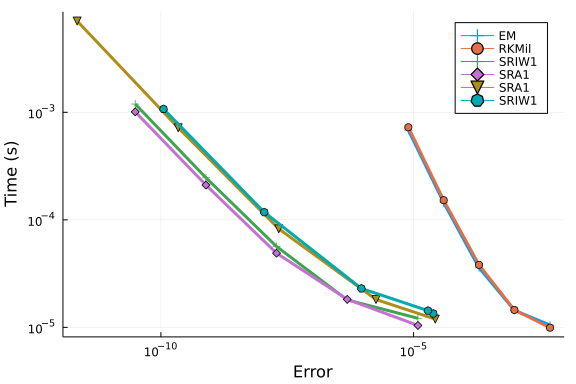
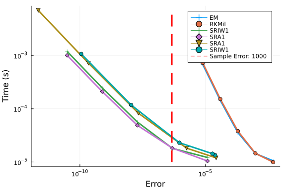
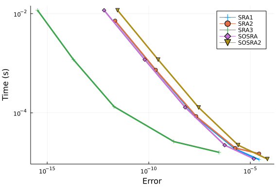
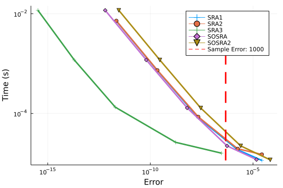
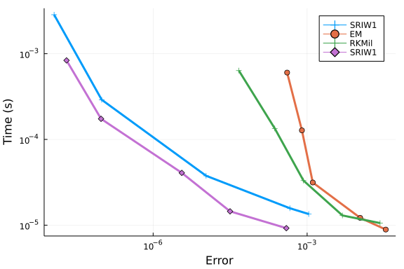
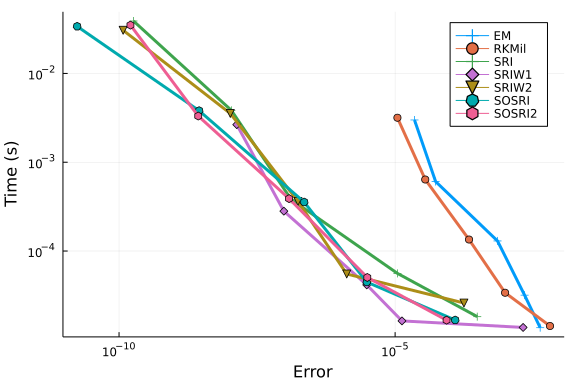
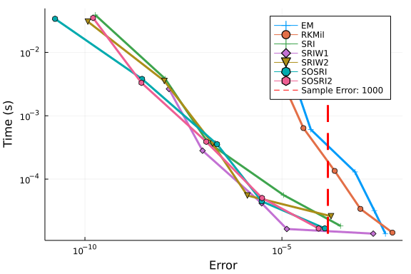
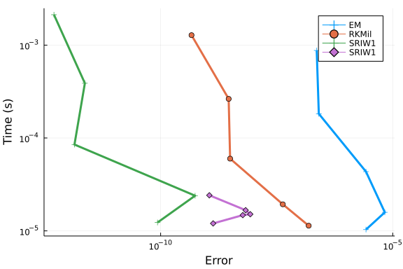
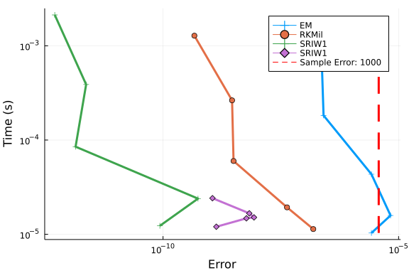
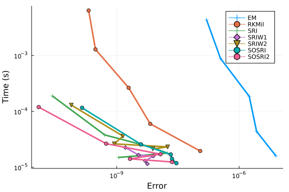

# SDE Basic Weak Work-Precision Diagrams

In this notebook we will run some benchmarks for the weak error on some simple sample SDEs. The weak error is defined as:

$$E_W = \mathbb{E}[Y_\delta(t)] - \mathbb{E}[Y(t)]$$

and is thus a measure of how close the mean of the numerical solution is to the mean of the true solution. Other moments can be measured as well, but the mean is a good stand-in for other properties. Note that convergence of the mean is calculated on a sample. Thus there's acutally two sources of error. We have not only the error between the numerical and actual results, but we also have the error of the mean to the true mean due to only taking a finite sample. Using the normal confidence interval of the mean due to the Central Limit Theorem, the error due to finite sampling is

$$E_S = V[Y(t)]/\sqrt(N)$$

for $N$ being the number of samples. In practice,

$$E = minimum(E_W,E_S)$$

Thus in each case, we will determine the variance of the true solution and use that to estimate the sample error, and the goal is to thus find the numerical method that achieves the sample error most efficiently.

```julia
using StochasticDiffEq, DiffEqDevTools, ParameterizedFunctions, DiffEqProblemLibrary
using Plots; gr()
using DiffEqProblemLibrary.SDEProblemLibrary: importsdeproblems; importsdeproblems()
import DiffEqProblemLibrary.SDEProblemLibrary: prob_sde_additive,
            prob_sde_linear, prob_sde_wave
const N = 1000
```

```
1000
```


### Additive Noise Problem

$$dX_{t}=\left(\frac{\beta}{\sqrt{1+t}}-\frac{1}{2\left(1+t\right)}X_{t}\right)dt+\frac{\alpha\beta}{\sqrt{1+t}}dW_{t},\thinspace\thinspace\thinspace X_{0}=\frac{1}{2}$$

where $\alpha=\frac{1}{10}$ and $\beta=\frac{1}{20}$. Actual Solution:

$$X_{t}=\frac{1}{\sqrt{1+t}}X_{0}+\frac{\beta}{\sqrt{1+t}}\left(t+\alpha W_{t}\right).$$

```julia
prob = prob_sde_additive

reltols = 1.0 ./ 10.0 .^ (1:5)
abstols = reltols#[0.0 for i in eachindex(reltols)]
setups = [
          Dict(:alg=>EM(),:dts=>1.0./5.0.^((1:length(reltols)) .+ 1))
          Dict(:alg=>RKMil(),:dts=>1.0./5.0.^((1:length(reltols)) .+ 1),:adaptive=>false)
          Dict(:alg=>SRIW1(),:dts=>1.0./5.0.^((1:length(reltols)) .+ 1),:adaptive=>false)
          Dict(:alg=>SRA1(),:dts=>1.0./5.0.^((1:length(reltols)) .+ 1),:adaptive=>false)
          Dict(:alg=>SRA1())
          Dict(:alg=>SRIW1())
          ]
wp = WorkPrecisionSet(prob,abstols,reltols,setups;numruns_error=N,
                      save_everystep = false,
                      parallel_type = :none,
                      error_estimate=:weak_final)#
plot(wp)
```



```julia
sample_size = Int[10;1e2;1e3;1e4]
se = get_sample_errors(prob,setups[6],numruns=sample_size,
                                      sample_error_runs = 100_000,solution_runs=100)
```

```
4-element Vector{Float64}:
 0.00038201624559140105
 4.0404520276138755e-5
 4.243611881146044e-6
 4.6111924322479253e-7
```


```julia
times = [wp[i].times for i in 1:length(wp)]
times = [minimum(minimum(t) for t in times),maximum(maximum(t) for t in times)]
plot!([se[end];se[end]],times,color=:red,linestyle=:dash,label="Sample Error: 1000",lw=3)
```



```julia
prob = prob_sde_additive

reltols = 1.0 ./ 10.0 .^ (1:5)
abstols = reltols#[0.0 for i in eachindex(reltols)]
setups = [
          Dict(:alg=>SRA1())
          Dict(:alg=>SRA2())
          Dict(:alg=>SRA3())
          Dict(:alg=>SOSRA())
          Dict(:alg=>SOSRA2())
          ]
wp = WorkPrecisionSet(prob,abstols,reltols,setups;numruns_error=N,
                      save_everystep = false,
                      maxiters = 1e7,
                      parallel_type = :none,
                      error_estimate=:weak_final)
plot(wp)
```



```julia
sample_size = Int[10;1e2;1e3;1e4]
se = get_sample_errors(prob,setups[4],numruns=sample_size,
                                      sample_error_runs = 100_000,solution_runs=100)
```

```
4-element Vector{Float64}:
 0.00043581069084387035
 3.4523792447718524e-5
 4.111470634425664e-6
 4.65158023458891e-7
```


```julia
times = [wp[i].times for i in 1:length(wp)]
times = [minimum(minimum(t) for t in times),maximum(maximum(t) for t in times)]
plot!([se[end];se[end]],times,color=:red,linestyle=:dash,label="Sample Error: 1000",lw=3)
```




### Scalar Noise

We will use a the linear SDE (also known as the Black-Scholes equation)

$$dX_{t}=\alpha X_{t}dt+\beta X_{t}dW_{t},\thinspace\thinspace\thinspace X_{0}=\frac{1}{2}$$

where $\alpha=\frac{1}{10}$ and $\beta=\frac{1}{20}$. Actual Solution:

$$X_{t}=X_{0}e^{\left(\beta-\frac{\alpha^{2}}{2}\right)t+\alpha W_{t}}.$$

```julia
prob = prob_sde_linear

reltols = 1.0 ./ 10.0 .^ (1:5)
abstols = reltols#[0.0 for i in eachindex(reltols)]

setups = [Dict(:alg=>SRIW1())
          Dict(:alg=>EM(),:dts=>1.0./5.0.^((1:length(reltols)) .+ 1))
          Dict(:alg=>RKMil(),:dts=>1.0./5.0.^((1:length(reltols)) .+ 1),:adaptive=>false)
          Dict(:alg=>SRIW1(),:dts=>1.0./5.0.^((1:length(reltols)) .+ 1),:adaptive=>false)
          ]
wp = WorkPrecisionSet(prob,abstols,reltols,setups;numruns_error=N,
                      save_everystep = false,
                      maxiters = 1e7,
                      parallel_type = :none,
                      error_estimate=:weak_final)
plot(wp)
```



```julia
sample_size = Int[10;1e2;1e3;1e4]
se = get_sample_errors(prob,setups[1],numruns=sample_size,
                                      sample_error_runs = 100_000,solution_runs=100)
```

```
4-element Vector{Float64}:
 0.19922469881167368
 0.019316322403609698
 0.0017604735356136516
 0.00016505065460638388
```


```julia
times = [wp[i].times for i in 1:length(wp)]
times = [minimum(minimum(t) for t in times),maximum(maximum(t) for t in times)]
plot!([se[end];se[end]],times,color=:red,linestyle=:dash,label="Sample Error: 1000",lw=3)
```


```julia
prob = prob_sde_linear

reltols = 1.0 ./ 10.0 .^ (1:5)
abstols = reltols#[0.0 for i in eachindex(reltols)]

setups = [Dict(:alg=>EM(),:dts=>1.0./5.0.^((1:length(reltols)) .+ 2))
          Dict(:alg=>RKMil(),:dts=>1.0./5.0.^((1:length(reltols)) .+ 2),:adaptive=>false)
          Dict(:alg=>SRI())
          Dict(:alg=>SRIW1())
          Dict(:alg=>SRIW2())
          Dict(:alg=>SOSRI())
          Dict(:alg=>SOSRI2())
          ]
wp = WorkPrecisionSet(prob,abstols,reltols,setups;numruns_error=N,
                      save_everystep = false,
                      maxiters = 1e7,
                      parallel_type = :none,
                      error_estimate=:weak_final)
plot(wp)
```



```julia
sample_size = Int[10;1e2;1e3;1e4]
se = get_sample_errors(prob,setups[6],numruns=sample_size,
                                      sample_error_runs = 100_000,solution_runs=100)
```

```
4-element Vector{Float64}:
 0.15835803307405844
 0.01583928777807832
 0.001978217992194449
 0.0001467369607473422
```


```julia
times = [wp[i].times for i in 1:length(wp)]
times = [minimum(minimum(t) for t in times),maximum(maximum(t) for t in times)]
plot!([se[end];se[end]],times,color=:red,linestyle=:dash,label="Sample Error: 1000",lw=3)
```




## Scalar Wave SDE

$$dX_{t}=-\left(\frac{1}{10}\right)^{2}\sin\left(X_{t}\right)\cos^{3}\left(X_{t}\right)dt+\frac{1}{10}\cos^{2}\left(X_{t}\right)dW_{t},\thinspace\thinspace\thinspace X_{0}=\frac{1}{2}$$

Actual Solution:

$$X_{t}=\arctan\left(\frac{1}{10}W_{t}+\tan\left(X_{0}\right)\right).$$

```julia
prob = prob_sde_wave

reltols = 1.0 ./ 10.0 .^ (1:5)
abstols = reltols#[0.0 for i in eachindex(reltols)]

setups = [
          Dict(:alg=>EM(),:dts=>1.0./5.0.^((1:length(reltols)) .+ 1))
          Dict(:alg=>RKMil(),:dts=>1.0./5.0.^((1:length(reltols)) .+ 1),:adaptive=>false)
          Dict(:alg=>SRIW1(),:dts=>1.0./5.0.^((1:length(reltols)) .+ 1),:adaptive=>false)
          Dict(:alg=>SRIW1())
          ]

wp = WorkPrecisionSet(prob,abstols,reltols,setups;numruns_error=N,
                      save_everystep = false,
                      maxiters = 1e7,
                      parallel_type = :none,
                      error_estimate=:weak_final)
plot(wp)
```



```julia
sample_size = Int[10;1e2;1e3;1e4]
se = get_sample_errors(prob,setups[4],numruns=sample_size,
                                      sample_error_runs = 100_000,solution_runs=100)
```

```
4-element Vector{Float64}:
 0.00329115857833945
 0.0003479453001338689
 3.085349598386125e-5
 3.7880560886797466e-6
```


```julia
times = [wp[i].times for i in 1:length(wp)]
times = [minimum(minimum(t) for t in times),maximum(maximum(t) for t in times)]
plot!([se[end];se[end]],times,color=:red,linestyle=:dash,label="Sample Error: 1000",lw=3)
```



```julia
prob = prob_sde_wave

reltols = 1.0 ./ 10.0 .^ (1:5)
abstols = reltols#[0.0 for i in eachindex(reltols)]

setups = [Dict(:alg=>EM(),:dts=>1.0./5.0.^((1:length(reltols)) .+ 2))
          Dict(:alg=>RKMil(),:dts=>1.0./5.0.^((1:length(reltols)) .+ 2),:adaptive=>false)
          Dict(:alg=>SRI())
          Dict(:alg=>SRIW1())
          Dict(:alg=>SRIW2())
          Dict(:alg=>SOSRI())
          Dict(:alg=>SOSRI2())
          ]
wp = WorkPrecisionSet(prob,abstols,reltols,setups;numruns_error=N,
                      save_everystep = false,
                      maxiters = 1e7,
                      parallel_type = :none,
                      error_estimate=:weak_final)
plot(wp)
```



```julia
sample_size = Int[10;1e2;1e3;1e4]
se = get_sample_errors(prob,setups[6],numruns=sample_size,
                                      sample_error_runs = 100_000,solution_runs=100)
```

```
4-element Vector{Float64}:
 0.003608220446617405
 0.00031854199011498765
 3.36802780035321e-5
 3.6364514619717173e-6
```


```julia
times = [wp[i].times for i in 1:length(wp)]
times = [minimum(minimum(t) for t in times),maximum(maximum(t) for t in times)]
plot!([se[end];se[end]],times,color=:red,linestyle=:dash,label="Sample Error: 1000",lw=3)
```


## Summary

In the additive noise problem, the `EM` and `RKMil` algorithms are not effective at reaching the sample error. In the other two problems, the `EM` and `RKMil` algorithms are as efficient as the higher order methods at achieving the maximal weak error.


## Appendix

These benchmarks are a part of the SciMLBenchmarks.jl repository, found at: [https://github.com/SciML/SciMLBenchmarks.jl](https://github.com/SciML/SciMLBenchmarks.jl). For more information on high-performance scientific machine learning, check out the SciML Open Source Software Organization [https://sciml.ai](https://sciml.ai).

To locally run this benchmark, do the following commands:

```
using SciMLBenchmarks
SciMLBenchmarks.weave_file("benchmarks/NonStiffSDE","BasicSDEWeakWorkPrecision.jmd")
```

Computer Information:

```
Julia Version 1.7.3
Commit 742b9abb4d (2022-05-06 12:58 UTC)
Platform Info:
  OS: Linux (x86_64-pc-linux-gnu)
  CPU: AMD EPYC 7502 32-Core Processor
  WORD_SIZE: 64
  LIBM: libopenlibm
  LLVM: libLLVM-12.0.1 (ORCJIT, znver2)
Environment:
  JULIA_CPU_THREADS = 128
  BUILDKITE_PLUGIN_JULIA_CACHE_DIR = /cache/julia-buildkite-plugin
  JULIA_DEPOT_PATH = /cache/julia-buildkite-plugin/depots/5b300254-1738-4989-ae0a-f4d2d937f953

```

Package Information:

```
      Status `/cache/build/exclusive-amdci3-0/julialang/scimlbenchmarks-dot-jl/benchmarks/NonStiffSDE/Project.toml`
  [f3b72e0c] DiffEqDevTools v2.31.1
  [a077e3f3] DiffEqProblemLibrary v4.17.0
  [65888b18] ParameterizedFunctions v5.13.2
  [91a5bcdd] Plots v1.31.6
  [31c91b34] SciMLBenchmarks v0.1.1
  [789caeaf] StochasticDiffEq v6.52.0
```

And the full manifest:

```
      Status `/cache/build/exclusive-amdci3-0/julialang/scimlbenchmarks-dot-jl/benchmarks/NonStiffSDE/Manifest.toml`
  [c3fe647b] AbstractAlgebra v0.27.3
  [1520ce14] AbstractTrees v0.4.2
  [79e6a3ab] Adapt v3.4.0
  [dce04be8] ArgCheck v2.3.0
  [ec485272] ArnoldiMethod v0.2.0
  [4fba245c] ArrayInterface v6.0.22
  [30b0a656] ArrayInterfaceCore v0.1.17
  [6ba088a2] ArrayInterfaceGPUArrays v0.2.1
  [015c0d05] ArrayInterfaceOffsetArrays v0.1.6
  [b0d46f97] ArrayInterfaceStaticArrays v0.1.4
  [dd5226c6] ArrayInterfaceStaticArraysCore v0.1.0
  [4c555306] ArrayLayouts v0.8.11
  [15f4f7f2] AutoHashEquals v0.2.0
  [aae01518] BandedMatrices v0.17.4
  [198e06fe] BangBang v0.3.36
  [9718e550] Baselet v0.1.1
  [e2ed5e7c] Bijections v0.1.4
  [62783981] BitTwiddlingConvenienceFunctions v0.1.4
  [8e7c35d0] BlockArrays v0.16.20
  [ffab5731] BlockBandedMatrices v0.11.9
  [2a0fbf3d] CPUSummary v0.1.25
  [00ebfdb7] CSTParser v3.3.6
  [49dc2e85] Calculus v0.5.1
  [479239e8] Catalyst v12.2.0
  [d360d2e6] ChainRulesCore v1.15.3
  [9e997f8a] ChangesOfVariables v0.1.4
  [fb6a15b2] CloseOpenIntervals v0.1.10
  [944b1d66] CodecZlib v0.7.0
  [35d6a980] ColorSchemes v3.19.0
  [3da002f7] ColorTypes v0.11.4
  [c3611d14] ColorVectorSpace v0.9.9
  [5ae59095] Colors v0.12.8
  [861a8166] Combinatorics v1.0.2
  [a80b9123] CommonMark v0.8.6
  [38540f10] CommonSolve v0.2.1
  [bbf7d656] CommonSubexpressions v0.3.0
  [34da2185] Compat v3.45.0
  [b152e2b5] CompositeTypes v0.1.2
  [a33af91c] CompositionsBase v0.1.1
  [8f4d0f93] Conda v1.7.0
  [187b0558] ConstructionBase v1.4.0
  [d38c429a] Contour v0.6.2
  [adafc99b] CpuId v0.3.1
  [a8cc5b0e] Crayons v4.1.1
  [9a962f9c] DataAPI v1.10.0
  [864edb3b] DataStructures v0.18.13
  [e2d170a0] DataValueInterfaces v1.0.0
  [244e2a9f] DefineSingletons v0.1.2
  [b429d917] DensityInterface v0.4.0
  [2b5f629d] DiffEqBase v6.95.2
  [459566f4] DiffEqCallbacks v2.23.1
  [f3b72e0c] DiffEqDevTools v2.31.1
  [77a26b50] DiffEqNoiseProcess v5.12.1
  [9fdde737] DiffEqOperators v4.43.1
  [a077e3f3] DiffEqProblemLibrary v4.17.0
  [163ba53b] DiffResults v1.0.3
  [b552c78f] DiffRules v1.11.0
  [b4f34e82] Distances v0.10.7
  [31c24e10] Distributions v0.25.66
  [ffbed154] DocStringExtensions v0.8.6
  [5b8099bc] DomainSets v0.5.11
  [fa6b7ba4] DualNumbers v0.6.8
  [7c1d4256] DynamicPolynomials v0.4.5
  [d4d017d3] ExponentialUtilities v1.18.0
  [e2ba6199] ExprTools v0.1.8
  [411431e0] Extents v0.1.1
  [c87230d0] FFMPEG v0.4.1
  [7034ab61] FastBroadcast v0.2.1
  [9aa1b823] FastClosures v0.3.2
  [29a986be] FastLapackInterface v1.2.2
  [1a297f60] FillArrays v0.13.2
  [6a86dc24] FiniteDiff v2.15.0
  [53c48c17] FixedPointNumbers v0.8.4
  [59287772] Formatting v0.4.2
  [f6369f11] ForwardDiff v0.10.32
  [069b7b12] FunctionWrappers v1.1.2
  [46192b85] GPUArraysCore v0.1.1
  [28b8d3ca] GR v0.66.0
  [c145ed77] GenericSchur v0.5.3
  [cf35fbd7] GeoInterface v1.0.1
  [5c1252a2] GeometryBasics v0.4.3
  [d7ba0133] Git v1.2.1
  [86223c79] Graphs v1.7.1
  [42e2da0e] Grisu v1.0.2
  [0b43b601] Groebner v0.2.10
  [d5909c97] GroupsCore v0.4.0
  [cd3eb016] HTTP v1.2.1
  [eafb193a] Highlights v0.4.5
  [3e5b6fbb] HostCPUFeatures v0.1.8
  [34004b35] HypergeometricFunctions v0.3.11
  [7073ff75] IJulia v1.23.3
  [615f187c] IfElse v0.1.1
  [d25df0c9] Inflate v0.1.2
  [83e8ac13] IniFile v0.5.1
  [22cec73e] InitialValues v0.3.1
  [18e54dd8] IntegerMathUtils v0.1.0
  [8197267c] IntervalSets v0.7.1
  [3587e190] InverseFunctions v0.1.7
  [92d709cd] IrrationalConstants v0.1.1
  [c8e1da08] IterTools v1.4.0
  [42fd0dbc] IterativeSolvers v0.9.2
  [82899510] IteratorInterfaceExtensions v1.0.0
  [692b3bcd] JLLWrappers v1.4.1
  [682c06a0] JSON v0.21.3
  [98e50ef6] JuliaFormatter v1.0.9
  [ccbc3e58] JumpProcesses v9.1.0
  [ef3ab10e] KLU v0.3.0
  [ba0b0d4f] Krylov v0.8.3
  [0b1a1467] KrylovKit v0.5.4
  [b964fa9f] LaTeXStrings v1.3.0
  [2ee39098] LabelledArrays v1.12.0
  [23fbe1c1] Latexify v0.15.16
  [10f19ff3] LayoutPointers v0.1.10
  [5078a376] LazyArrays v0.22.11
  [d7e5e226] LazyBandedMatrices v0.7.17
  [2d8b4e74] LevyArea v1.0.0
  [d3d80556] LineSearches v7.1.1
  [7ed4a6bd] LinearSolve v1.23.3
  [2ab3a3ac] LogExpFunctions v0.3.17
  [e6f89c97] LoggingExtras v0.4.9
  [bdcacae8] LoopVectorization v0.12.121
  [1914dd2f] MacroTools v0.5.9
  [d125e4d3] ManualMemory v0.1.8
  [a3b82374] MatrixFactorizations v0.9.2
  [739be429] MbedTLS v1.1.3
  [442fdcdd] Measures v0.3.1
  [e9d8d322] Metatheory v1.3.4
  [128add7d] MicroCollections v0.1.2
  [e1d29d7a] Missings v1.0.2
  [961ee093] ModelingToolkit v8.18.9
  [46d2c3a1] MuladdMacro v0.2.2
  [102ac46a] MultivariatePolynomials v0.4.6
  [ffc61752] Mustache v1.0.14
  [d8a4904e] MutableArithmetics v1.0.4
  [d41bc354] NLSolversBase v7.8.2
  [2774e3e8] NLsolve v4.5.1
  [872c559c] NNlib v0.8.9
  [77ba4419] NaNMath v0.3.7
  [8913a72c] NonlinearSolve v0.3.22
  [6fe1bfb0] OffsetArrays v1.12.7
  [429524aa] Optim v1.7.1
  [bac558e1] OrderedCollections v1.4.1
  [1dea7af3] OrdinaryDiffEq v6.20.0
  [90014a1f] PDMats v0.11.16
  [65888b18] ParameterizedFunctions v5.13.2
  [d96e819e] Parameters v0.12.3
  [69de0a69] Parsers v2.3.2
  [ccf2f8ad] PlotThemes v3.0.0
  [995b91a9] PlotUtils v1.3.0
  [91a5bcdd] Plots v1.31.6
  [e409e4f3] PoissonRandom v0.4.1
  [f517fe37] Polyester v0.6.14
  [1d0040c9] PolyesterWeave v0.1.8
  [85a6dd25] PositiveFactorizations v0.2.4
  [d236fae5] PreallocationTools v0.4.2
  [21216c6a] Preferences v1.3.0
  [27ebfcd6] Primes v0.5.3
  [1fd47b50] QuadGK v2.4.2
  [74087812] Random123 v1.6.0
  [fb686558] RandomExtensions v0.4.3
  [e6cf234a] RandomNumbers v1.5.3
  [3cdcf5f2] RecipesBase v1.2.1
  [01d81517] RecipesPipeline v0.6.3
  [731186ca] RecursiveArrayTools v2.32.0
  [f2c3362d] RecursiveFactorization v0.2.11
  [189a3867] Reexport v1.2.2
  [42d2dcc6] Referenceables v0.1.2
  [05181044] RelocatableFolders v0.1.3
  [ae029012] Requires v1.3.0
  [ae5879a3] ResettableStacks v1.1.1
  [37e2e3b7] ReverseDiff v1.14.1
  [79098fc4] Rmath v0.7.0
  [47965b36] RootedTrees v2.12.1
  [7e49a35a] RuntimeGeneratedFunctions v0.5.3
  [3cdde19b] SIMDDualNumbers v0.1.1
  [94e857df] SIMDTypes v0.1.0
  [476501e8] SLEEFPirates v0.6.33
  [0bca4576] SciMLBase v1.48.0
  [31c91b34] SciMLBenchmarks v0.1.1
  [6c6a2e73] Scratch v1.1.1
  [efcf1570] Setfield v0.8.2
  [992d4aef] Showoff v1.0.3
  [777ac1f9] SimpleBufferStream v1.1.0
  [699a6c99] SimpleTraits v0.9.4
  [66db9d55] SnoopPrecompile v1.0.0
  [b85f4697] SoftGlobalScope v1.1.0
  [a2af1166] SortingAlgorithms v1.0.1
  [47a9eef4] SparseDiffTools v1.25.1
  [276daf66] SpecialFunctions v2.1.7
  [171d559e] SplittablesBase v0.1.14
  [aedffcd0] Static v0.7.6
  [90137ffa] StaticArrays v1.5.2
  [1e83bf80] StaticArraysCore v1.0.1
  [82ae8749] StatsAPI v1.5.0
  [2913bbd2] StatsBase v0.33.21
  [4c63d2b9] StatsFuns v1.0.1
  [789caeaf] StochasticDiffEq v6.52.0
  [7792a7ef] StrideArraysCore v0.3.15
  [69024149] StringEncodings v0.3.5
  [09ab397b] StructArrays v0.6.11
  [d1185830] SymbolicUtils v0.19.11
  [0c5d862f] Symbolics v4.10.4
  [3783bdb8] TableTraits v1.0.1
  [bd369af6] Tables v1.7.0
  [62fd8b95] TensorCore v0.1.1
  [8ea1fca8] TermInterface v0.2.3
  [8290d209] ThreadingUtilities v0.5.0
  [ac1d9e8a] ThreadsX v0.1.10
  [a759f4b9] TimerOutputs v0.5.20
  [0796e94c] Tokenize v0.5.24
  [3bb67fe8] TranscodingStreams v0.9.6
  [28d57a85] Transducers v0.4.73
  [a2a6695c] TreeViews v0.3.0
  [d5829a12] TriangularSolve v0.1.13
  [5c2747f8] URIs v1.4.0
  [3a884ed6] UnPack v1.0.2
  [1cfade01] UnicodeFun v0.4.1
  [1986cc42] Unitful v1.11.0
  [41fe7b60] Unzip v0.1.2
  [3d5dd08c] VectorizationBase v0.21.46
  [81def892] VersionParsing v1.3.0
  [19fa3120] VertexSafeGraphs v0.2.0
  [44d3d7a6] Weave v0.10.10
  [ddb6d928] YAML v0.4.7
  [c2297ded] ZMQ v1.2.1
  [700de1a5] ZygoteRules v0.2.2
  [6e34b625] Bzip2_jll v1.0.8+0
  [83423d85] Cairo_jll v1.16.1+1
  [5ae413db] EarCut_jll v2.2.3+0
  [2e619515] Expat_jll v2.4.8+0
  [b22a6f82] FFMPEG_jll v4.4.2+0
  [a3f928ae] Fontconfig_jll v2.13.93+0
  [d7e528f0] FreeType2_jll v2.10.4+0
  [559328eb] FriBidi_jll v1.0.10+0
  [0656b61e] GLFW_jll v3.3.8+0
  [d2c73de3] GR_jll v0.66.0+0
  [78b55507] Gettext_jll v0.21.0+0
  [f8c6e375] Git_jll v2.34.1+0
  [7746bdde] Glib_jll v2.68.3+2
  [3b182d85] Graphite2_jll v1.3.14+0
  [2e76f6c2] HarfBuzz_jll v2.8.1+1
  [aacddb02] JpegTurbo_jll v2.1.2+0
  [c1c5ebd0] LAME_jll v3.100.1+0
  [88015f11] LERC_jll v3.0.0+1
  [dd4b983a] LZO_jll v2.10.1+0
  [e9f186c6] Libffi_jll v3.2.2+1
  [d4300ac3] Libgcrypt_jll v1.8.7+0
  [7e76a0d4] Libglvnd_jll v1.3.0+3
  [7add5ba3] Libgpg_error_jll v1.42.0+0
  [94ce4f54] Libiconv_jll v1.16.1+1
  [4b2f31a3] Libmount_jll v2.35.0+0
  [89763e89] Libtiff_jll v4.4.0+0
  [38a345b3] Libuuid_jll v2.36.0+0
  [e7412a2a] Ogg_jll v1.3.5+1
  [458c3c95] OpenSSL_jll v1.1.17+0
  [efe28fd5] OpenSpecFun_jll v0.5.5+0
  [91d4177d] Opus_jll v1.3.2+0
  [2f80f16e] PCRE_jll v8.44.0+0
  [30392449] Pixman_jll v0.40.1+0
  [ea2cea3b] Qt5Base_jll v5.15.3+1
  [f50d1b31] Rmath_jll v0.3.0+0
  [a2964d1f] Wayland_jll v1.19.0+0
  [2381bf8a] Wayland_protocols_jll v1.25.0+0
  [02c8fc9c] XML2_jll v2.9.14+0
  [aed1982a] XSLT_jll v1.1.34+0
  [4f6342f7] Xorg_libX11_jll v1.6.9+4
  [0c0b7dd1] Xorg_libXau_jll v1.0.9+4
  [935fb764] Xorg_libXcursor_jll v1.2.0+4
  [a3789734] Xorg_libXdmcp_jll v1.1.3+4
  [1082639a] Xorg_libXext_jll v1.3.4+4
  [d091e8ba] Xorg_libXfixes_jll v5.0.3+4
  [a51aa0fd] Xorg_libXi_jll v1.7.10+4
  [d1454406] Xorg_libXinerama_jll v1.1.4+4
  [ec84b674] Xorg_libXrandr_jll v1.5.2+4
  [ea2f1a96] Xorg_libXrender_jll v0.9.10+4
  [14d82f49] Xorg_libpthread_stubs_jll v0.1.0+3
  [c7cfdc94] Xorg_libxcb_jll v1.13.0+3
  [cc61e674] Xorg_libxkbfile_jll v1.1.0+4
  [12413925] Xorg_xcb_util_image_jll v0.4.0+1
  [2def613f] Xorg_xcb_util_jll v0.4.0+1
  [975044d2] Xorg_xcb_util_keysyms_jll v0.4.0+1
  [0d47668e] Xorg_xcb_util_renderutil_jll v0.3.9+1
  [c22f9ab0] Xorg_xcb_util_wm_jll v0.4.1+1
  [35661453] Xorg_xkbcomp_jll v1.4.2+4
  [33bec58e] Xorg_xkeyboard_config_jll v2.27.0+4
  [c5fb5394] Xorg_xtrans_jll v1.4.0+3
  [8f1865be] ZeroMQ_jll v4.3.4+0
  [3161d3a3] Zstd_jll v1.5.2+0
  [a4ae2306] libaom_jll v3.4.0+0
  [0ac62f75] libass_jll v0.15.1+0
  [f638f0a6] libfdk_aac_jll v2.0.2+0
  [b53b4c65] libpng_jll v1.6.38+0
  [a9144af2] libsodium_jll v1.0.20+0
  [f27f6e37] libvorbis_jll v1.3.7+1
  [1270edf5] x264_jll v2021.5.5+0
  [dfaa095f] x265_jll v3.5.0+0
  [d8fb68d0] xkbcommon_jll v1.4.1+0
  [0dad84c5] ArgTools v1.1.1
  [56f22d72] Artifacts
  [2a0f44e3] Base64
  [ade2ca70] Dates
  [8bb1440f] DelimitedFiles
  [8ba89e20] Distributed
  [f43a241f] Downloads v1.6.0
  [7b1f6079] FileWatching
  [9fa8497b] Future
  [b77e0a4c] InteractiveUtils
  [b27032c2] LibCURL v0.6.3
  [76f85450] LibGit2
  [8f399da3] Libdl
  [37e2e46d] LinearAlgebra
  [56ddb016] Logging
  [d6f4376e] Markdown
  [a63ad114] Mmap
  [ca575930] NetworkOptions v1.2.0
  [44cfe95a] Pkg v1.8.0
  [de0858da] Printf
  [3fa0cd96] REPL
  [9a3f8284] Random
  [ea8e919c] SHA v0.7.0
  [9e88b42a] Serialization
  [1a1011a3] SharedArrays
  [6462fe0b] Sockets
  [2f01184e] SparseArrays
  [10745b16] Statistics
  [4607b0f0] SuiteSparse
  [fa267f1f] TOML v1.0.0
  [a4e569a6] Tar v1.10.0
  [8dfed614] Test
  [cf7118a7] UUIDs
  [4ec0a83e] Unicode
  [e66e0078] CompilerSupportLibraries_jll v0.5.2+0
  [deac9b47] LibCURL_jll v7.81.0+0
  [29816b5a] LibSSH2_jll v1.10.2+0
  [c8ffd9c3] MbedTLS_jll v2.28.0+0
  [14a3606d] MozillaCACerts_jll v2022.2.1
  [4536629a] OpenBLAS_jll v0.3.20+0
  [05823500] OpenLibm_jll v0.8.1+0
  [efcefdf7] PCRE2_jll v10.40.0+0
  [bea87d4a] SuiteSparse_jll v5.10.1+0
  [83775a58] Zlib_jll v1.2.12+3
  [8e850b90] libblastrampoline_jll v5.1.0+0
  [8e850ede] nghttp2_jll v1.41.0+1
  [3f19e933] p7zip_jll v17.4.0+0
```

